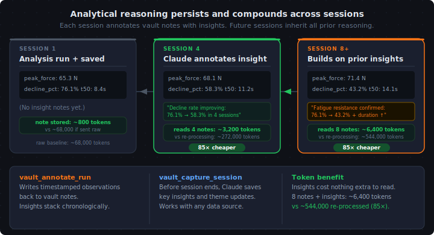
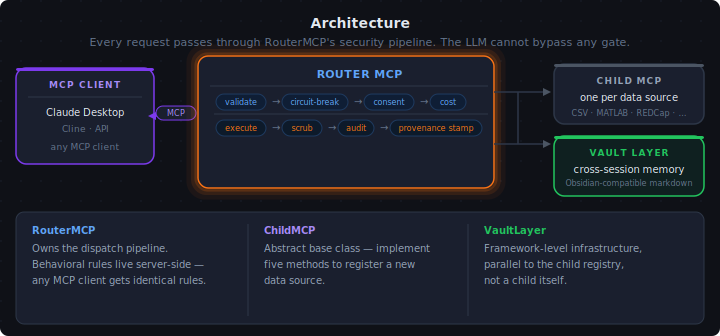

<p align="center">
  
</p>

<p align="center">
  <a href="https://github.com/saahasmuthineni/tailor-mcp/actions/workflows/ci.yml"></a>
  
  
  
  
  <a href="https://pypi.org/project/tailor-mcp/"></a>
  <a href="https://pypi.org/project/tailor-mcp/"></a>
  <a href="https://pypi.org/project/tailor-mcp/"></a>
</p>

# tailor-mcp

**Tailor** is a local MCP server that preprocesses your structured data before it reaches the AI — computations run on your machine, results come back as summaries rather than raw streams, and every action is logged to a local SQLite audit database. Analytical notes persist in an Obsidian-compatible vault, surviving session boundaries. It works with any structured source: CSV directories, force-plate recordings, REDCap exports, running data, or anything you register.

> 📦 [PyPI](https://pypi.org/project/tailor-mcp/) · [Worked example notebook](docs/guides/worked-example.ipynb) · [ADRs](docs/adr/) · [Changelog](CHANGELOG.md)

---

## The numbers

| Scenario | Raw to Claude | Through Tailor | Reduction |
|---|---|---|---|
| Single subject, computed report | ~526,000 tokens | ~800 tokens | **657×** |
| 16-subject cohort | exceeds context window | ~800 tokens | **938×** (and it fits) |
| 5-session thread pickup | ~$57.90 | ~$0.04 | **1,448×** |

*Measured, reproducible benchmark — [methodology →](benchmarks/token_efficiency.md)*

The 938× reduction is the ratio between a Tier-1 computed report (~800 tokens) and the raw per-second stream for the same data (~750,000 tokens for a 15-mile run). Results are identical — the computation happens server-side.

---

## Quickstart

**Prerequisites — install these first:**

1. **[Claude Desktop](https://claude.ai/download)** (Windows: Microsoft Store; macOS: claude.ai/download)
2. **[uv](https://docs.astral.sh/uv/getting-started/installation/)** — the package installer Tailor uses

   ```bash
   # Windows (PowerShell)
   powershell -ExecutionPolicy ByPass -c "irm https://astral.sh/uv/install.ps1 | iex"

   # macOS / Linux
   curl -LsSf https://astral.sh/uv/install.sh | sh
   ```

**Install and run:**

```bash
uv tool install tailor-mcp
tailor pilot
```

`tailor pilot` runs a three-prompt setup wizard, registers Tailor with Claude Desktop, and configures your first data source. Fully quit and reopen Claude Desktop (system-tray Exit on Windows; Cmd+Q on macOS), then ask:

> *Are men or women losing strength faster in this cohort?*

Claude will call a tool, run the computation locally, and return per-group statistics. Nothing leaves your machine.

---

## Who it's for

**Good fit:**
- RSEs and researchers building LLM-assisted analysis pipelines where data governance, audit trails, or reproducibility matter
- Teams integrating structured data sources with Claude Desktop or other MCP-compliant clients and wanting server-side computation over raw-data prompts
- Anyone who needs a local-first setup — no data leaves the machine

**Not a good fit:**
- Clinical decision-support or regulatory-compliance deployments — Tailor is research infrastructure, not a validated clinical tool
- Hosted or cloud workflows — the architecture is deliberately local-first
- Projects requiring an independent security audit — this is a solo-maintainer project with no external review yet

---

## What it is

Tailor is middleware, not an application. It does not provide a UI, a database, or a cloud service. What it provides is a governance layer that sits between an LLM client and any number of structured data sources:

- **Parameter validation and circuit breaking** before execution
- **Tiered consent and cost gates** — the LLM cannot escalate to higher-resolution data without explicit user approval
- **PHI/sensitive data scrubbing seam** — no-op by default; subclass per child for institutional policy
- **Audit logging** — every tool call recorded with tool name, tier, outcome, duration, and token count
- **Provenance stamps** — every result carries `_meta` (package version, UTC timestamp, tier, token count)
- **VaultLayer** — analytical notes written to Obsidian-compatible markdown, surviving session boundaries

The running-data (Strava) child ships as a worked example of the ChildMCP extension pattern, not as the headline use case. The same framework handles any data source you register.

<p align="center">
  
</p>

---

## Data tiers

Every tool in every child declares a tier. The router enforces each gate before execution — the LLM cannot bypass it.

| Tier | What the LLM sees | Typical token range | Gate |
|------|-------------------|---------------------|------|
| **1 — Free** | Server-computed reports: summaries, stats, trends, anomalies | 200 – 1,500 | None |
| **2 — Consent** | Downsampled streams at 5–30 s resolution | 3,000 – 7,000 | Domain consent |
| **3 — Cost** | Full per-timestamp streams with precision reduction | 25,000 – 60,000 | Consent + cost approval |

Most analytical questions are answerable at Tier 1. The 938× token reduction is the ratio between a Tier-1 computed report (~800 tokens) and the raw per-second stream for the same data (~750,000 tokens for a 15-mile run). Results are identical — the computation happens server-side.

<p align="center">
  
</p>

---

## Architecture

<p align="center">
  
</p>

`RouterMCP` owns the dispatch pipeline. `ChildMCP` is an abstract base class — implement five methods to register a new data source. `VaultLayer` is framework-level infrastructure, parallel to the child registry, not a child itself.

Full detail: [ADRs](docs/adr/) · [Worked example](docs/guides/worked-example.ipynb)

---

## Adding a data source

Copy `children/template/` and implement five things:

1. `domain` and `display_name`
2. `consent_info` — what data types the child exposes and why
3. `tool_definitions` — tools and their tiers
4. `execute()` and `estimate_cost()`

`children/csv_dir/` is a complete second worked example (generic CSV directory, Tier-1 cohort surface, REDCap-shaped metadata sidecar).

---

## Status

Validated on **Windows 11** (Microsoft Store Claude Desktop) and **macOS**. Community validation is ongoing — issues and reports welcome.

Cross-client compatibility confirmed: Cline 3.85.0 round-trip with full `_meta` block and matching audit row (v8.0.0, 2026-05-26). Any MCP-compliant client works without bespoke accommodation.

CI matrix: Ubuntu · Windows · macOS × Python 3.10–3.12. 795 tests (pytest + standalone security probe). Coverage floor 80%.

---

## License

Apache-2.0 (≤ v7.x) · AGPL-3.0 (v8.0.0+)
