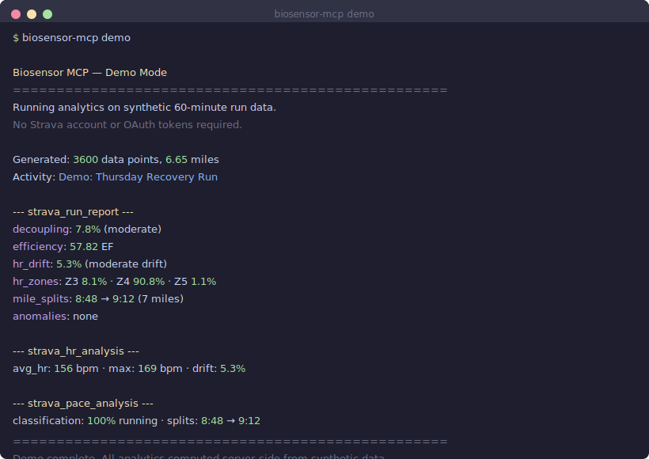
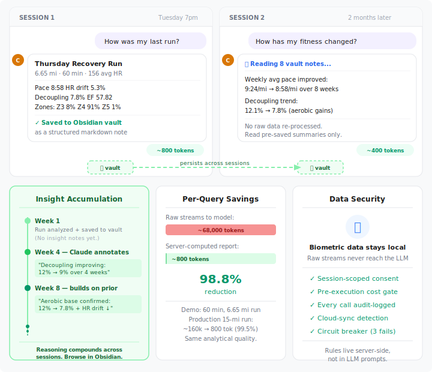
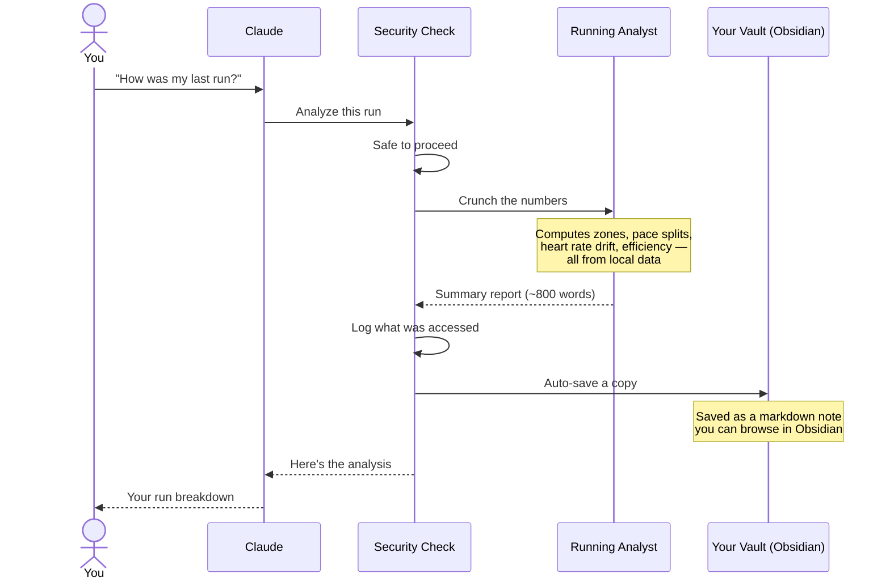
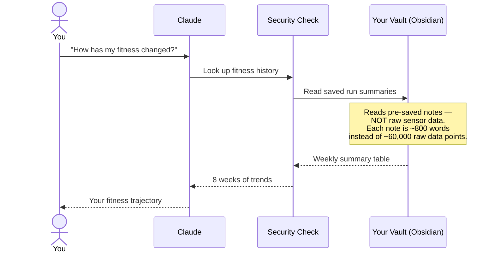
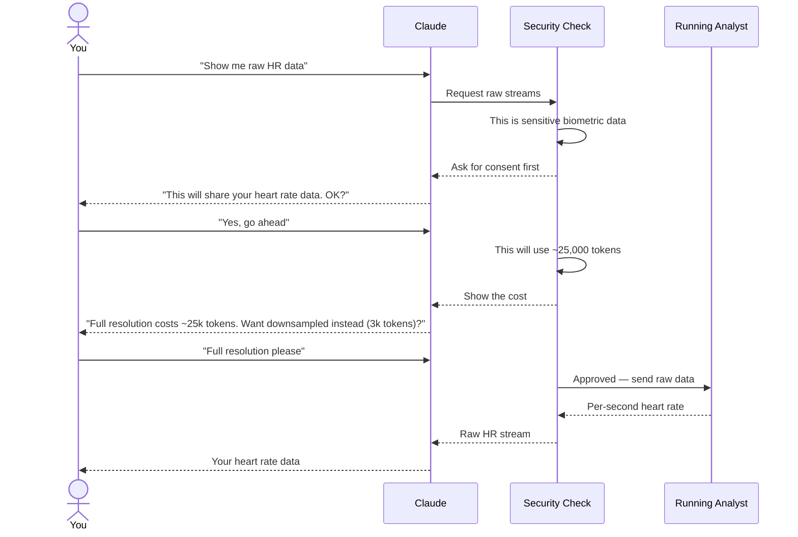
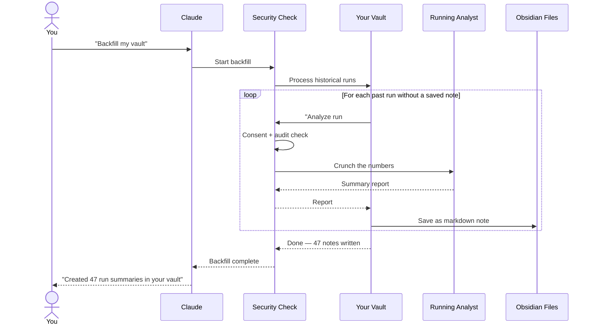
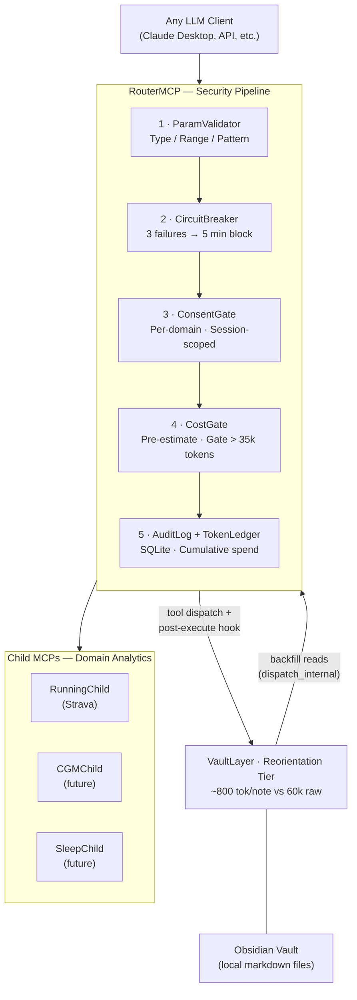

# Biosensor → LLM Middleware

[](https://github.com/saahasmuthineni/biosensor-to-llm-middleware/actions/workflows/ci.yml)
[](https://www.python.org/downloads/)
[](LICENSE)

Ask Claude Desktop about your Strava runs — without burning $60/month in tokens.

A local MCP server that compresses biosensor data server-side before it reaches the model. A 15-mile run drops from ~200,000 tokens ($60/mo) to ~800 tokens ($0.02/mo) — **99.6% reduction** — while raw per-second data stays on your machine.

**Runners:** install, connect Strava, ask Claude about your training. [Install ↓](#install)
**Builders:** reference implementation of a general biosensor→LLM framework (CGM, sleep, ECG follow the same pattern). [Framework docs ↓](#for-framework-builders)

> **Try it with zero setup:** `pip install -e . && biosensor-mcp demo` — runs on synthetic data, no Strava account needed.

## Quick navigation

| Runners | Builders |
|---------|----------|
| [Try it in 30 seconds](#try-it-in-30-seconds) | [Architecture diagram](#for-framework-builders) |
| [What you can ask Claude](#what-you-can-ask-claude) | [Building your own child MCP](#for-framework-builders) |
| [Why this exists (cost breakdown)](#why-this-exists) | [Security pipeline](#how-it-works) |
| [Install](#install) | [Three-tier access model](#how-it-works) |
| [How it works](#how-it-works) | [Design context (PDF)](#further-reading) |
| [Reference (tools, examples)](#reference) | [Reference (tools, examples)](#reference) |

---

## Try it in 30 seconds

No Strava account, no OAuth, no API keys. The demo runs server-side analytics on synthetic 60-minute run data:

```bash
git clone https://github.com/saahasmuthineni/biosensor-to-llm-middleware.git
cd biosensor-to-llm-middleware
pip install -e .
biosensor-mcp demo
```

<p align="center">
  
</p>

---

## What you can ask Claude

| Ask Claude… | What you get | Cost |
|---|---|---|
| "How was my last run?" | Zones, splits, drift, efficiency — [auto-saved to vault](#vault-tools) | ~800 tok |
| "How has my fitness changed over 2 months?" | Weekly trends from [pre-saved notes](#vault-tools) | ~400 tok |
| "Show me my raw heart rate data" | Full-res stream (asks [consent + cost](#how-it-works) first) | 25–60k tok |
| "Backfill my vault with past runs" | Bulk-generates summaries for cached runs | per-run |

<p align="center">
  
</p>

---

## Why this exists

High-frequency biosensor data and LLMs are a bad match out of the box:

| Data source | Raw size | Direct cost | After this framework |
|-------------|----------|-------------|----------------------|
| 15-mile run (8 stream types, 1Hz) | ~200,000 tokens | ~$60/month | ~800 tokens (~$0.02) |
| CGM trace (glucose, 5-min intervals) | ~10,000 tokens/day | — | ~200 tokens |
| Sleep staging (per-epoch) | ~5,000 tokens/night | — | ~150 tokens |

Server-side analytics compute what the LLM actually needs — zones, splits, trends, anomalies — and return only the summary. **99.6% token reduction** in the running example. Raw per-second data never leaves the machine.

---

## Install

### Prerequisites

- Python 3.10+
- Claude Desktop
- Strava account with an API app ([strava.com/settings/api](https://www.strava.com/settings/api)) — set callback domain to `localhost`

### One-liner install

**Mac / Linux:**
```bash
curl -sSL https://raw.githubusercontent.com/saahasmuthineni/biosensor-to-llm-middleware/main/install.sh | bash
```

**Windows (PowerShell):**
```powershell
irm https://raw.githubusercontent.com/saahasmuthineni/biosensor-to-llm-middleware/main/install.ps1 | iex
```

Restart Claude Desktop after install. Then ask Claude to sync and analyze your runs.

---

## How it works

### Your Data, Two Ways

Every analysis the system produces is saved as a plain markdown file in your [Obsidian](https://obsidian.md/) vault — a local, offline notebook that lives on your machine.

This means you have **two ways to access the same data**:

| | Ask Claude | Browse in Obsidian |
|---|---|---|
| **Best for** | Questions, trends, comparisons | Visual browsing, manual notes |
| **How it works** | Reads pre-saved summaries (~400-800 tokens) | Opens the same markdown files directly |
| **Example** | "Compare my last 3 long runs" | Open the graph view to see connections |
| **Data stays** | On your machine | On your machine |

**No cloud sync by default.** If your vault folder is inside OneDrive, iCloud, or Dropbox, the system warns you at startup — because saved analytics would then leave your machine. Set `vault_path` to a local-only folder to keep everything offline.

### Security Pipeline

| Layer | Component | Purpose |
|-------|-----------|---------|
| 1 | `ParamValidator` | Type/range/pattern checks — reject before any work |
| 2 | `CircuitBreaker` | Block domain after 3 consecutive failures; auto-reset after 5 min |
| 3 | `ConsentGate` | Per-domain biometric consent, session-scoped, revocable |
| 4 | `CostGate` | Pre-estimate tokens before execution; gate if > 35,000 tokens |
| 5 | `AuditLog` + `TokenLedger` | Every call logged to SQLite; cumulative session spend |

### Three-Tier Access Model

| Tier | What the LLM Sees | Tokens | Gate |
|------|------------------|--------|------|
| 1 — Free | Server-computed reports (zones, splits, trends, anomalies) | 200–1,500 | None |
| 2 — Consent | Downsampled streams at 5–30s intervals | 3,000–7,000 | Biometric consent |
| 3 — Cost | Per-second streams with precision reduction | 25,000–60,000 | Consent + cost approval |

~90% of questions are answered at Tier 1. Zero raw biometric data leaves the machine.

---

## Reference

### Sequence diagrams

What happens behind the scenes for each type of question:

<details>
<summary><strong>You ask: "How was my last run?"</strong> — Instant analysis, automatically saved</summary>



**What happened:** Your run data (thousands of data points) was crunched down to a short summary — and automatically saved to your personal vault so Claude can reference it in future conversations without re-processing.

**Cost:** ~800 tokens (< $0.01). No approval needed.

</details>

<details>
<summary><strong>You ask: "How has my fitness changed over the last 2 months?"</strong> — Answered from saved notes, no re-processing</summary>



**What happened:** Instead of re-downloading and re-processing 8 weeks of raw heart rate and GPS data (which would cost ~$5 in tokens), Claude read the pre-saved vault notes. Same quality analysis, 99% cheaper.

**Cost:** ~400 tokens (< $0.01). No Strava API call. No raw biometric data touched.

</details>

<details>
<summary><strong>You ask: "Show me my raw heart rate data"</strong> — Sensitive data, requires your permission</summary>



**What happened:** The system asked you twice — once for consent (it's your biometric data), once for cost (raw data is expensive). You chose full resolution, so you got it. But 90% of the time, the first flow ("How was my last run?") answers the same question for 1/30th the cost.

</details>

<details>
<summary><strong>You say: "Backfill my vault with all my past runs"</strong> — Bulk-saves historical data for future use</summary>



**What happened:** The system went through all your cached runs and created a summary note for each one. Every single analysis went through the same security checks — even internal operations are audited. Now Claude can answer questions about months of training history instantly from your vault.

</details>

### Running Tools

| Tool | Tier | What It Does | ~Tokens |
|------|------|-------------|---------|
| `strava_sync` | 1 | Pull recent activities from Strava into local cache | ~50 |
| `strava_list_runs` | 1 | List recent runs with summary stats | ~400 |
| `strava_activity_detail` | 1 | Full details for a single activity | ~200 |
| `strava_run_report` | 1 | Full run analysis: decoupling, EF, drift, phases, GAP splits | ~800 |
| `strava_trend_report` | 1 | Weekly volume, pace, HR trends | ~600 |
| `strava_compare_runs` | 1 | Side-by-side comparison of 2–5 runs | ~1,500 |
| `strava_hr_analysis` | 1 | Zone distribution, drift, anomalies | ~300 |
| `strava_pace_analysis` | 1 | Mile splits, run/walk classification | ~300 |
| `strava_stop_analysis` | 1 | Pause detection with GPS locations | ~200 |
| `strava_label_stop` | 1 | Persist stop labels across sessions (e.g. "Gel 1/3") | ~50 |
| `strava_downsampled_streams` | 2 | HR, pace, GPS at 5–30s intervals | 3,000–7,000 |
| `strava_full_streams` | 3 | Per-second data with selective stream filtering | 25,000–60,000 |

<details>
<summary>Example: strava_run_report response (~800 tokens)</summary>

```json
{
  "activity_id": 12345678,
  "data_points": 5420,
  "decoupling": {
    "decoupling_pct": 4.2,
    "first_half": {"avg_hr": 152, "avg_velocity": 2.95},
    "second_half": {"avg_hr": 159, "avg_velocity": 2.88},
    "interpretation": "well coupled"
  },
  "efficiency_factor": {"ef": 1.34, "avg_hr": 155, "avg_velocity_ms": 2.91},
  "hr_drift": {
    "first_half_avg": 152,
    "second_half_avg": 159,
    "drift_pct": 4.6,
    "interpretation": "aerobic"
  },
  "hr_zones": {
    "zone_seconds": {1: 114, 2: 996, 3: 2833, 4: 1344, 5: 133},
    "zone_pct": {1: 2.1, 2: 18.4, 3: 52.3, 4: 24.8, 5: 2.4},
    "avg_hr": 156,
    "max_hr_observed": 178,
    "max_hr_setting": 185
  },
  "mile_splits": [
    {"mile": 1, "elapsed_seconds": 552, "pace": "9:12", "avg_velocity_ms": 2.91},
    {"mile": 2, "elapsed_seconds": 540, "pace": "9:00", "avg_velocity_ms": 2.98}
  ],
  "anomalies": [],
  "note": "Full report computed server-side from per-second data. Raw streams not transmitted."
}
```

</details>

### Vault Tools

Claude can write run notes into an Obsidian vault and read them back in future sessions — persistent analytical memory across conversations.

Add `vault_path` to `~/.biosensor-mcp/user_config.json`:
```json
{
  "max_hr": 185,
  "resting_hr": 52,
  "vault_path": "/path/to/your/obsidian/vault"
}
```

| Vault Tool | What It Does |
|------------|-------------|
| `vault_get_fitness_summary` | 8-week aggregate snapshot — orient at session start |
| `vault_list_notes` | Browse notes by date, type, or insight status |
| `vault_read_note` | Read full body of a specific run note |
| `vault_search_notes` | Full-text search across all notes |
| `vault_list_anomalies` | Find runs with detected anomalies (HR spikes, etc.) |
| `vault_annotate_run` | Save analytical insights back to a note |
| `vault_backfill` | Generate notes for all cached historical runs |

<details>
<summary>Example: vault run note (Obsidian markdown)</summary>

```markdown
---
domain: running
note_type: run_report
activity_id: 12345678
date: "2026-04-10"
week: "2026-W15"
distance_miles: 10.12
duration_min: 87.3
avg_hr: 156
max_hr_observed: 178
decoupling_pct: 4.2
efficiency_factor: 1.34
hr_drift_pct: 4.6
aerobic_grade: coupled
anomaly_count: 0
tags:
  - running
  - aerobic/coupled
  - week/2026-W15
---

# Thursday Recovery Run

## Summary

| Field | Value |
|-------|-------|
| Date | 2026-04-10 |
| Distance | 10.12 mi |
| Duration | 87.3 min |
| Avg HR | 156 bpm |
| Aerobic Grade | coupled |
| Decoupling | 4.2% |
| Efficiency Factor | 1.34 |
| HR Drift | 4.6% |

## HR Analysis

Avg HR: **156 bpm** · Max: **178 bpm** · Setting: 185 bpm

| Zone | % Time | Seconds |
|------|--------|---------|
| Z1 | 2.1% | 114 |
| Z2 | 18.4% | 996 |
| Z3 | 52.3% | 2833 |
| Z4 | 24.8% | 1344 |
| Z5 | 2.4% | 133 |

## Insights

*(No insight notes yet.)*
```

</details>

> **Privacy:** If your vault is in a cloud-synced folder (iCloud, OneDrive, Dropbox), the server warns you and computed analytics will be uploaded. Use a local path to keep data on-device.

### Commands

```
biosensor-mcp demo       — Run analytics on synthetic data (no Strava needed)
biosensor-mcp status     — Check configuration and connectivity
biosensor-mcp setup      — Re-run Strava OAuth setup
biosensor-mcp uninstall  — Clean removal
```

### Configuration

`~/.biosensor-mcp/user_config.json`:
```json
{
  "max_hr": 185,
  "resting_hr": 52,
  "home_lat": 42.360,
  "home_lng": -71.058
}
```

---

## For framework builders

The reference implementation (Strava running) demonstrates a general pattern for any biosensor domain. The router owns all cross-cutting concerns. Children own domain logic. The vault is a shared persistence layer — every analysis is automatically saved as a compressed note (~800 tokens vs ~60,000 raw), enabling rich longitudinal queries across future sessions. Any LLM client gets identical security enforcement — behavioral rules live server-side, not in prompts.



### Building Your Own Child

Implement 4 abstract methods and register with the router:

```python
from biosensor_mcp.framework import ChildMCP, ToolDefinition, CostEstimate, ValidationSchema, ConsentInfo

class CGMChild(ChildMCP):
    @property
    def domain(self) -> str: return "cgm"

    @property
    def display_name(self) -> str: return "Glucose (Dexcom)"

    @property
    def consent_info(self) -> ConsentInfo:
        return ConsentInfo(
            data_types=["glucose levels", "meal markers"],
            purpose="glycemic analysis and trends",
        )

    @property
    def tool_definitions(self) -> list[ToolDefinition]:
        return [ToolDefinition("cgm_daily_report", 1, "Time-in-range, variability, meal response", {...})]

    @property
    def param_schemas(self) -> dict: ...

    async def execute(self, tool_name: str, params: dict) -> dict: ...

    async def estimate_cost(self, tool_name: str, params: dict) -> CostEstimate: ...

# Register in __main__.py cmd_serve():
router.register_child(CGMChild(config_dir, data_dir))
# Router auto-generates approve_consent_cgm + revoke_consent_cgm
```

The router handles consent prompting, cost gating, circuit breaking, audit logging, and token tracking automatically. The child only implements domain analytics.

**Other biosensor domains this pattern applies to:**
- CGM (Dexcom, Libre) — time-in-range, glycemic variability, meal response curves
- Sleep (Oura, Whoop) — stage duration, efficiency, latency, fragmentation
- ECG (Apple Watch, Kardia) — rhythm classification, HRV, QT intervals
- Lab results — trend analysis, reference range flags, longitudinal comparison

See [docs/design-context.pdf](docs/design-context.pdf) for the full design rationale.

## Troubleshooting

| Problem | Fix |
|---------|-----|
| `status` shows token expired | Run `biosensor-mcp setup` to re-authenticate. Tokens auto-refresh on use, but the refresh token itself can expire after 6 months of inactivity. |
| Claude says "consent is required" | This is expected — biometric consent is session-scoped and resets each conversation. Approve once per session. |
| Tool returns "No stream data available" | Run `strava_sync` first to pull activities into the local cache. Some activities (treadmill) may lack GPS streams. |
| "address already in use" during OAuth | The setup wizard uses port 8189 for the localhost OAuth callback. Close any process using that port, or restart and retry. |
| Cost gate triggered unexpectedly | Only `strava_full_streams` triggers the cost gate (>35,000 tokens). Use `strava_downsampled_streams` for visualization — it's ~85% cheaper. |

## Further reading

See [docs/design-context.pdf](docs/design-context.pdf) for the original design context document.

## License

Apache-2.0
