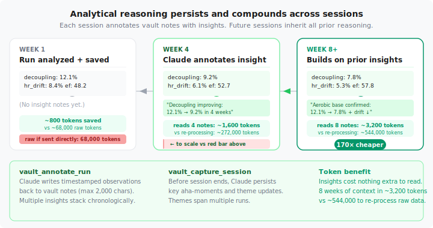
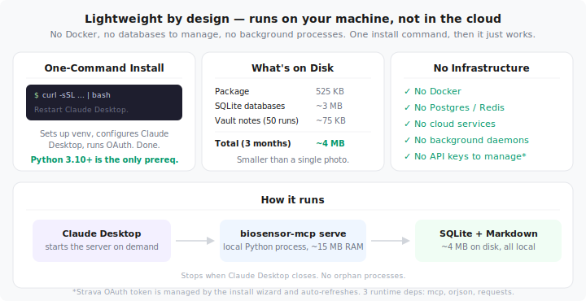
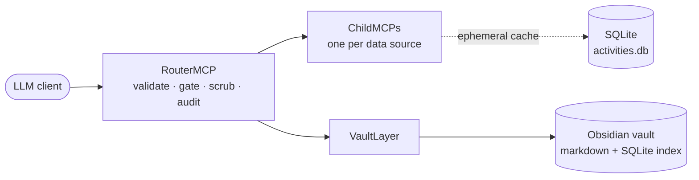

# Biosensor MCP — LLM-Assisted Analysis for Health Research

[](https://github.com/saahasmuthineni/biosensor-to-llm-middleware/actions/workflows/ci.yml)
[](https://www.python.org/downloads/)
[](.github/workflows/ci.yml)
[](LICENSE)

Local-first infrastructure for LLM-assisted analysis of high-frequency
biometric data — built for health research workflows where data
governance, audit trails, and reproducibility matter.

## 30-second quickstart

```bash
git clone https://github.com/saahasmuthineni/biosensor-to-llm-middleware.git
cd biosensor-to-llm-middleware
pip install -e ".[dev]"
biosensor-mcp demo           # analytics on synthetic data — no OAuth, no network
biosensor-mcp --help         # see all commands
```

### Start here

- **Researcher / research-software engineer** → [Why this exists](#why-this-exists) · [How data minimization works](#how-data-minimization-works)
- **Developer trying the demo** → [Install & run](#install--run) · [Running child tools](#running-child-tools)
- **Architect / integrator** → [Architecture](#architecture) · [Adding a new child data source](CLAUDE.md#adding-a-new-childmcp-new-data-source)
- **Curious where this is going** → [What's next](#whats-next) · [full ROADMAP.md](ROADMAP.md)

---

## Who this is for

**For you if** you run health research involving high-frequency biometric
streams, you use an MCP-speaking LLM client (Claude Desktop, Claude API,
VS Code), and you need audit trails and data-minimization controls that
survive beyond a single chat session.

**Not for you if** you want clinical decision support, you're OK pasting
streams into a hosted chat, or you need a finished product rather than
extensible research infrastructure.

---

## What you get

| Capability | What it does |
|---|---|
| **Local-first router** | Runs next to the data. Raw streams never leave the machine. Only server-computed summaries cross the boundary, and only when a tier and consent gate say they should. |
| **Tiered access** | Every tool declares an access tier: 1 returns computed summaries, 2 returns downsampled views behind a consent gate, 3 returns raw streams behind consent + cost approval. Data minimization, implemented. |
| **Durable audit log** | Every call lands in SQLite: timestamp, tool, tier, parameters, outcome, latency, optional `subject_id`. Attachable to a protocol amendment or replication package. |
| **Provenance stamps** | Every result carries a `_meta` block — package version, tool name, UTC timestamp — so any output in a paper is traceable to the code that produced it. |
| **Obsidian-backed vault** | Cross-session analytical memory: themes (persistent research questions), moments (observations), evidence logs. Markdown is the source of truth; SQLite makes it queryable. |
| **Extensible child pattern** | Each data source is a ChildMCP. New children inherit the full governance pipeline by implementing a small interface. |

---

## Example interaction

```
User:   summarize my last run
Claude: [calls strava_run_report — Tier 1, no consent required]

Tool:   {"summary": "6.2 mi · 48:12 · avg HR 152",
         "drift_pct": 3.2, "efficiency_factor": 1.71,
         "_meta": {"package_version": "4.0.0",
                   "tool_name": "strava_run_report",
                   "called_at": "2026-04-13T15:42:11Z"}}

Claude: Your last run was 6.2 miles in 48:12 with 3.2 % HR drift and
        an efficiency factor of 1.71 — aerobic base looks solid.
        The audit log recorded this call; the _meta block stamps
        the code version that produced these numbers.
```

The tier model, audit row, and `_meta` stamp all fired without the
analyst doing anything. That's the point.

---

## Why this exists

Research groups working with high-frequency biometric data (CGM, ECG,
sleep staging, wearable streams) keep hitting the same three problems
when they use LLMs as analytical assistants:

| Problem | Response |
|---|---|
| **Data governance** — hosted LLMs are the wrong home for participant biometric data. Pasting streams into web chats is usually against policy, sometimes against law, and always leaves no defensible trace. | Tier model + local-first processing. Raw data never leaves the machine; only server-computed summaries do. |
| **Reproducibility** — analyses in chat windows don't replay six months later. No log of which tool saw which data, no hook for a replication package. | Audit log (every call in SQLite with optional `subject_id`) + `_meta` provenance stamps on every result. |
| **Longitudinal memory** — observations get dropped at session end. The note an analyst made about a participant in April is exactly what the analyst in September needs. | Vault layer: themes, moments, evidence logs — append-only, Obsidian-backed, queryable across sessions. |

Biosensor MCP is a local MCP server that sits between any MCP-speaking
client and your data sources, owning the cross-cutting concerns — gating,
scrubbing, audit, provenance, durable memory — that each problem needs.

---

## How data minimization works

| Tier | What the LLM sees | Typical tokens | Gate |
|---|---|---|---|
| **1 — Free** | Server-computed reports (splits, zones, drift, decoupling, EF, trends) | 200 – 1,500 | *None* |
| **2 — Consent** | Downsampled streams at 5 – 30 s for visualization | 3,000 – 7,000 | Biometric consent |
| **3 — Cost** | Per-timestamp streams with precision reduction | 25,000 – 60,000 | Consent + cost approval |

Most analytical questions are answerable at Tier 1 — zero raw biometric
data leaving the machine. Token counts are from the running child; other
domains will differ.

Every tool call is persisted to SQLite with enough context to reconstruct
what happened:

```json
{
  "timestamp":      "2026-04-13T15:42:11.203Z",
  "domain":         "running",
  "tool_name":      "strava_run_report",
  "tier":           1,
  "params":         {"activity_id": 14829301},
  "token_estimate": 1180,
  "outcome":        "ok",
  "duration_ms":    142,
  "subject_id":     "P-017"
}
```

Every successful result carries a `_meta` provenance stamp:

```json
{
  "_meta": {
    "package_version": "4.0.0",
    "tool_name":       "strava_run_report",
    "called_at":       "2026-04-13T15:42:11.345Z"
  }
}
```

The vault layer adds cross-session analytical memory — **themes**
(persistent research questions with appending evidence logs) and
**moments** (timestamped observations linkable to participants or runs).
See [research-framing.md](docs/research-framing.md#the-vault-layer--longitudinal-analytical-memory)
for the full treatment.

<p align="center">
  
</p>

---

## Status

- One child ships: a Strava running child exercising all three tiers,
  OAuth, cached streams, and the vault writer. Treat it as a template,
  not a dependency.
- CGM, sleep, ECG, EDF, CSV, and FHIR children are roadmap.
  See [ROADMAP.md](ROADMAP.md).
- PHI scrubbing ships as a documented no-op seam. Institutions subclass
  once their policy is defined.
- Per-subject audit scoping is first-class; per-subject tool parameters
  are roadmap.

**Scope limit:** This is research infrastructure, not a clinical
decision-support system. It has not been validated against any regulatory
framework for patient-facing tools. Analytical output requires human
validation before informing decisions. See
[research-framing.md](docs/research-framing.md#scope-limit) for the
full statement.

---

## Install & run

### Prerequisites

- Python 3.10+
- An MCP-speaking LLM client (Claude Desktop is the reference).

### Install

```bash
git clone https://github.com/saahasmuthineni/biosensor-to-llm-middleware.git
cd biosensor-to-llm-middleware
pip install -e ".[dev]"
```

### Verify

```bash
biosensor-mcp --help
pytest -v
python tests/security_probe.py
```

### Connecting an MCP client

Add to your Claude Desktop config (`claude_desktop_config.json`):

```json
{
  "mcpServers": {
    "biosensor-mcp": {
      "command": "~/.biosensor-mcp/venv/bin/python",
      "args": ["-m", "biosensor_mcp", "serve"],
      "env": {
        "BIOSENSOR_CONFIG_DIR": "~/.biosensor-mcp",
        "BIOSENSOR_DATA_DIR": "~/.biosensor-mcp/data"
      }
    }
  }
}
```

Replace `~/.biosensor-mcp/venv/bin/python` with the path to your Python
interpreter.

### Commands

| Command | Description |
|---|---|
| `biosensor-mcp serve` | Start the MCP server (invoked by the LLM client) |
| `biosensor-mcp demo` | Run analytics on synthetic data (no network) |
| `biosensor-mcp setup` | Strava OAuth wizard (for the worked example) |
| `biosensor-mcp status` | Diagnostic check: tokens, DB state, vault config |
| `biosensor-mcp uninstall` | Clean removal |

### Worked example: the running child

```bash
biosensor-mcp demo     # synthetic data, no Strava account needed
```

To run against live Strava data:

1. Create a Strava API app at
   [strava.com/settings/api](https://www.strava.com/settings/api)
   (set callback to `localhost`).
2. Run `biosensor-mcp setup` to complete OAuth.
3. Restart your MCP client and query — *"summarize my last run"*,
   *"how has my HR drift changed?"* — to see the full pipeline in action.

### Running child tools

Twelve tools across three tiers:

| Tool | Tier | Description |
|---|---|---|
| `strava_sync` | 1 | Pull recent activities into local cache |
| `strava_list_runs` | 1 | List recent runs with summary stats |
| `strava_activity_detail` | 1 | Single-activity overview |
| `strava_hr_analysis` | 1 | Zone distribution, drift, anomalies |
| `strava_pace_analysis` | 1 | Mile splits, run/walk classification |
| `strava_stop_analysis` | 1 | Pause detection with GPS + saved labels |
| `strava_label_stop` | 1 | Persist stop label to SQLite |
| `strava_run_report` | 1 | Comprehensive: decoupling, EF, drift, phases, GAP |
| `strava_trend_report` | 1 | Rolling weekly volume, avg pace, avg HR |
| `strava_compare_runs` | 1 | Side-by-side comparison of 2–5 runs |
| `strava_downsampled_streams` | 2 | HR, pace, GPS at 5–30 s intervals |
| `strava_full_streams` | 3 | Per-second data with precision reduction |

---

## What's next

The framework is deliberately a worked example plus an extension seam,
not a finished product. The top items on the roadmap — each with a
reason it matters, not just a title:

| Next up | Why it matters |
|---|---|
| [**New ChildMCPs**](ROADMAP.md#new-childmcps-for-research-relevant-data-sources) (CGM, sleep, ECG, CSV, EDF, FHIR) | Second worked example unlocks broader adoption; a `children/template/` skeleton cuts onboarding from 1,500 lines of reading to filling five blanks. |
| [**`subject_id` as a first-class tool parameter**](ROADMAP.md#per-subject-parameter-scoping-on-existing-tools) | Audit rows already support it; surfacing it on tools makes multi-participant studies first-class. |
| [**Real PHI-scrubbing implementations**](ROADMAP.md#real-phi-scrubbing-implementations-behind-the-phiscrubber-slot) | The seam is wired and instrumented; a real policy per child is what any deployment touching actual PHI needs. |
| [**Deterministic mode + provenance hashing**](ROADMAP.md#deterministic-mode-with-seed-control) | Lets a reviewer re-run an analysis and trace every published number to exact code + exact input bytes. |
| [**"Freeze vault" for manuscript submission**](ROADMAP.md#freeze-vault-operation-for-manuscript-submission) | One-command archive of vault + audit + code version for attaching to a submission. |
| [**LLM-client evaluation harness**](ROADMAP.md#evaluation-harness-for-llm-client-behavior) | Makes "client-agnostic governance" a measurable claim rather than a design assertion. |

Full list with effort/impact triage and design notes: [**ROADMAP.md**](ROADMAP.md).

If any of these is the reason you showed up, open a GitHub discussion
or issue before writing code — several have real design questions
(especially `subject_id` → vault keying) worth talking through.

---

## Architecture

<p align="center">
  
</p>



- The **Router** enforces validation, circuit breaking, consent,
  cost, PHI scrubbing, audit, and token accounting — identically for
  every child.
- A **ChildMCP** owns one data source and exposes tools at declared
  access tiers. The running child is one such implementation.
- The **Vault Layer** handles cross-session analytical memory. Vault
  tools skip consent and cost gates (analyst notes, not biometric data)
  but still run through validation and audit.

Detailed notes in [CLAUDE.md](CLAUDE.md).

---

## Troubleshooting

| Issue | Fix |
|---|---|
| OAuth "address already in use" on port 8189 | Another process is bound to that port. Kill it or wait for it to release. |
| `rate_limit.json` corruption warning | Delete the file — it will be rebuilt on next API call. |
| `subject_id` not appearing in audit rows | Pass `subject_id` as a parameter in the tool call, not as a header. |
| Vault disabled silently | Check `~/.biosensor-mcp/logs/` for a `user_config.json` parse warning. |

---

## Further reading

| Document | Audience |
|---|---|
| [docs/research-framing.md](docs/research-framing.md) | Health-research reviewers evaluating this for a study |
| [ROADMAP.md](ROADMAP.md) | Anyone — what's deferred and why, with effort/impact triage |
| [CLAUDE.md](CLAUDE.md) | Contributors and operators |
| [docs/design-context.pdf](docs/design-context.pdf) | Historical design rationale |

## License

Apache-2.0.
