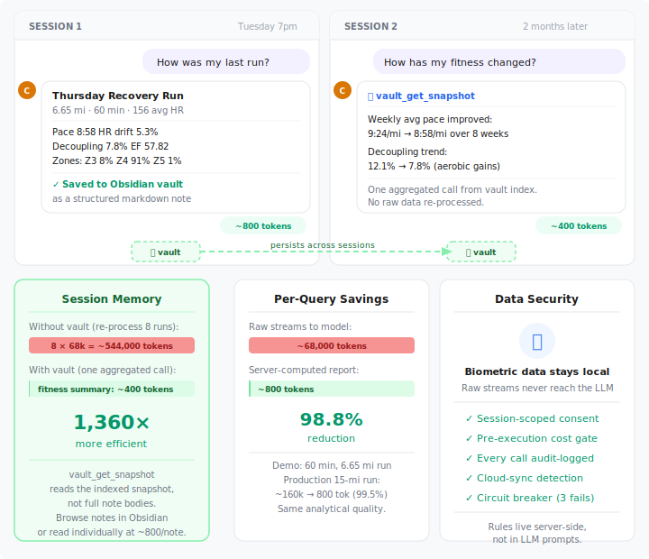
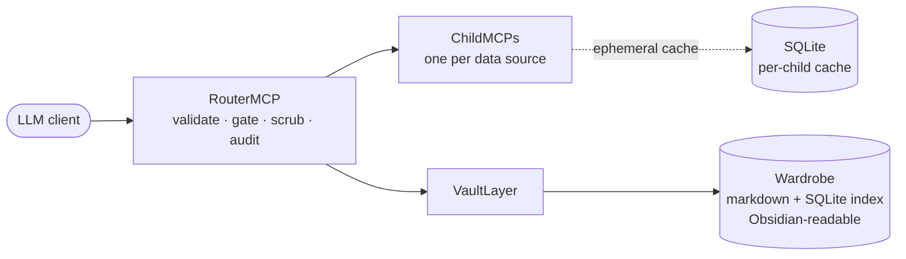

# Tailor — local data preprocessing for AI

[](https://www.python.org/downloads/)
[](.github/workflows/ci.yml)
[](LICENSE)

**Structured summaries, governed access, auditable answers.**

Dumping your raw data into a hosted LLM is expensive, unsafe, and
produces worse answers. **Expensive** because cohort-scale CSV at
$3–10 per million input tokens burns hundreds of dollars a month.
**Unsafe** because your data crosses to a vendor — and into whatever
logs, retention, or training pipelines you didn't tick the right
box to opt out of. **Worse answers** because the LLM's context window
goes to parsing 6,000 raw CSV rows it then has to re-aggregate by
hand, instead of reasoning over your actual question.

Tailor is a local-first MCP framework that preprocesses your data on
your machine and exposes only the structured summary the LLM needs.
Every call passes through a three-tier governance pipeline (free /
consent-gated / cost-gated), and every result lands in a durable
audit log next to the data. The framework is data-agnostic — CSV,
MATLAB binary, and REDCap exports ship today; EDF recordings, FHIR
bundles, and vendor sensor exports compose on the same engine
through a small `ChildMCP` extension. The first shipped end-to-end
recipe is health research; that's not the platform's identity.

## How much cheaper, exactly?

Two reproducible benchmarks in
[`benchmarks/token_efficiency.md`](benchmarks/token_efficiency.md):

| Scenario | Baseline (raw → LLM) | Tailor (Tier-1 → LLM) | Ratio |
|---|---:|---:|---:|
| Single subject — 60-second fatigue diagnostic | 48,006 tokens | 73 tokens | **657.6×** |
| 16-subject cohort comparison by sex | 769,311 tokens | 820 tokens | **938.2×** |
| Multi-session analytical-thread resume | 771,743 tokens | 2,427 tokens | **318.0×** |

The cohort baseline at 769,311 tokens exceeds Claude Sonnet's 200K
context window — at cohort scale the raw-data approach is not just
expensive, it is *structurally impossible* without a hand-engineered
chunking pipeline. The "at least 100× cheaper" claim in
[ADR 0029](docs/adr/0029-token-reduction-as-analytical-quality.md) is
a conservative floor; observed ratios run 3.2× to 9.4× the floor
depending on scenario.

All measurements use `tiktoken cl100k_base` (industry-standard proxy
for Claude's tokenizer), against synthetic-by-construction HIP-Lab
fixtures shipped in the wheel. The benchmark markdown carries an
Assumptions table, a quantitative prompt-caching counter-factual
(even optimal Anthropic prefix caching does not close the gap), and
a Limitations section naming where the gap is smaller. Methodology
is calibrated for a skeptical engineer, not for marketing.
Reproduce from a fresh clone:

```bash
pip install tiktoken && python benchmarks/token_efficiency.py
```

## 30-second quickstart

> *Phase 0 closed 2026-05-12 under the lenient read of the exit criterion — the install ritual below has been completed end-to-end by outside recipients on both Windows (Microsoft Store Claude Desktop) and macOS. The strict read (two clean outside-recipient installs on different OSes, project author untouched at every step) is still open. See [Status](#status). If you hit any friction installing cold, please open an issue — that's the highest-leverage diagnostic right now.*

For a PI or analyst running a multi-subject pilot — CSV, MATLAB, or REDCap:

```bash
uv tool install tailor-mcp
tailor pilot                       # defaults to CSV — three prompts, end-to-end smoke check
# Other source axes (multi-source coexistence preserved across runs):
tailor pilot --source=matlab       # .mat v5/v6/v7.2 directories (requires tailor-mcp[matlab])
tailor pilot --source=redcap       # REDCap export directories with project_metadata.csv data dictionary
```

For a developer exploring the framework:

```bash
git clone https://github.com/saahasmuthineni/tailor-mcp.git
cd tailor-mcp
pip install -e ".[dev]"
tailor --help         # see all commands
# Recipient-facing surfaces (walkthrough + fitting-room demo)
# moved to MCP tools in v8.0 per ADR 0040 — ask Claude in the
# Desktop app to "walk me through Tailor" or "scaffold the
# bundled demo" once `tailor pilot` has registered Tailor.
```

> **Bundled fixtures are synthetic by construction** per [ADR 0024 § "Synthetic-by-construction precondition"](docs/adr/0024-wheel-distributed-tour-and-fixture-bundling.md): the HIP Lab CSV files (`S001`–`S016`) shipped inside the wheel are random-walk traces sized to mimic real cohort shapes — not real participant data. The same precondition is what makes the wheel safe to share via PyPI or hand-deliver.

Then open [**docs/guides/worked-example.ipynb**](docs/guides/worked-example.ipynb) for a 10-minute end-to-end walkthrough: the router pipeline, a Tier-1 call, an audit row, the analyst-side consent gate firing, and a vault theme round-tripping to Obsidian-compatible markdown — all on synthetic data, no credentials required.

### Start here

- **PI evaluating for a study** → [Why this exists](#why-this-exists) · [How data minimization works](#how-data-minimization-works) · [10-minute worked example notebook](docs/guides/worked-example.ipynb) · [Status & retention](#status)
- **Analyst / research-software engineer wiring this up** → [Install & run](#install--run) · [Children that ship today](#children-that-ship-today) · [Architecture](#architecture)
- **IRB reviewer evaluating risk** → [How data minimization works](#how-data-minimization-works) · [Status & retention](#status) · [ADR 0001 — audit log](docs/adr/0001-audit-log-as-backbone.md) · [ADR 0003 — PHI scrubber seam](docs/adr/0003-phi-scrubber-seam.md) · [ADR 0009 — `entity_id` integrity](docs/adr/0009-vault-subject-keying.md) · [ADR 0013 — cache purge on consent revocation](docs/adr/0013-cache-only-purge-on-consent-revocation.md)
- **Quantified-self / future-recipe explorer** → [Your Wardrobe](#your-wardrobe) · [What This Project Is](CLAUDE.md#what-this-project-is) · [ROADMAP Phase 4 — platform-shape proof](ROADMAP.md#phase-4--platform-shape-proof-direction)
- **Developer trying the demo** → [Install & run](#install--run)
- **Architect / integrator** → [Architecture](#architecture) · [Adding a new child data source](CLAUDE.md#adding-a-new-childmcp-new-data-source)
- **Considering whether to install cold** → [ROADMAP — install-path validation closed 2026-05-12](ROADMAP.md#at-a-glance) (read the Status section before trying; the install is proven cross-OS but Phase 0 closed under the lenient read, not the strict one)
- **Curious where this is going** → [What's next](#whats-next) · [full ROADMAP.md](ROADMAP.md)

---

## Who this is for

**For you if** you run health research involving high-frequency biometric
streams, you use an MCP-speaking LLM client (Claude Desktop, Claude API,
VS Code), and you need audit trails and data-minimization controls that
survive beyond a single chat session.

**Not for you if** you want clinical decision support, you're OK pasting
your data into a hosted chat, or you need a polished consumer product
rather than a platform you can extend.

---

## What you get

| Capability | What it does |
|---|---|
| **Local-first router** | Runs next to your data. Only what the active tier permits crosses the boundary; tiers are declared per-tool, per-data-source. With the optional [local-LLM guardian](docs/guides/local-llm-guardian.md) opted in (per [ADR 0022](docs/adr/0022-local-llm-guardian.md)), your data stays on your machine at every tier — including from the hosted LLM. |
| **Tiered access** | Every tool declares an access tier: 1 returns computed summaries, 2 returns downsampled views behind an analyst-side consent gate, 3 returns raw streams behind that gate plus cost approval. Data minimization, implemented. |
| **PHI-scrubber seam** | A documented institutional override point. **Default is a no-op** — institutions subclass to wire their IRB-approved policy. The default surfaces a `scrubber_warning` field in every successful `_meta` block so a misconfigured deployment is visible inside the LLM transcript. See [ADR 0003](docs/adr/0003-phi-scrubber-seam.md). |
| **Durable audit log** | Every call lands in SQLite: timestamp, tool, tier, parameters, outcome, latency, `scrubber_id`, optional `entity_id`. Attachable to a protocol amendment or replication package. |
| **Provenance stamps** | Every result carries a `_meta` block — package version, tool name, domain, tier, UTC timestamp, per-call + session token counts, `scrubber_id`, plus `scrubber_warning` when the no-op default is active and `hook_warnings` when a post-execute hook raised. Any output in a paper is traceable to the code that produced it. |
| **Local-LLM guardian** *(opt-in)* | A framework-tier component that runs an LLM on your machine to compose structured natural-language responses over deterministic processing output. Cited numerical claims come from `processing.py` and stay deterministic; LLM-generated narrative is explicitly labelled non-citable in `_meta`. Four tiers (Scout/Sentinel/Guardian/Titan) span 4 GB laptops to 32 GB workstations. See [ADR 0022](docs/adr/0022-local-llm-guardian.md) and the [setup guide](docs/guides/local-llm-guardian.md). |
| **Wardrobe** *(Obsidian-readable)* | Cross-session analytical memory: themes (persistent questions), moments (observations), evidence logs, failure modes. Markdown is the source of truth; SQLite makes it queryable. See [Your Wardrobe](#your-wardrobe). |
| **Extensible child pattern** | Each data source is a ChildMCP. New children inherit the full governance pipeline by implementing a small interface. |

---

## Example interaction

This example uses the **running child** because it's the most-worked-out implementation — every tier exercised, every gate fired, every renderer covered. The `_meta` envelope and tier-gating semantics apply to every child; only the tool names and numerical fields change.

```
User:   summarize my last run
Claude: [calls strava_run_report — Tier 1, no consent required]

Tool:   {"summary": "6.2 mi · 48:12 · avg HR 152",
         "drift_pct": 3.2, "efficiency_factor": 1.71,
         "_meta": {"package_version":   "7.0.0",
                   "tool_name":         "strava_run_report",
                   "called_at":         "2026-04-13T15:42:11Z",
                   "scrubber_id":       "noop",
                   "scrubber_warning":  "DataScrubber is a no-op default; subclass and wire your institution's policy before processing real PHI"}}

Claude: Your last run was 6.2 miles in 48:12 with 3.2 % HR drift and
        an efficiency factor of 1.71 — aerobic base looks solid.
        The audit log recorded this call; the _meta block stamps
        the code version that produced these numbers.
```

<p align="center">
  
</p>

The tier model, audit row, and `_meta` stamp all fired without the
analyst doing anything. That's the point.

---

## Why this exists

Research groups working with high-frequency biometric data (CGM, ECG,
sleep staging, wearable streams) keep hitting the same three problems
when they use LLMs as analytical assistants:

| Problem | Response |
|---|---|
| **Data governance** — hosted LLMs are the wrong home for participant biometric data. Pasting streams into web chats is usually against policy, sometimes against law, and always leaves no defensible trace. | Tier model + local-first processing. Raw data never leaves the machine; only server-computed summaries do. |
| **Reproducibility** — analyses in chat windows don't replay six months later. No log of which tool saw which data, no hook for a replication package. | Audit log (every call in SQLite with optional `entity_id`) + `_meta` provenance stamps on every result. |
| **Longitudinal memory** — observations get dropped at session end. The note an analyst made about a participant in April is exactly what the analyst in September needs. | Vault layer: themes, moments, evidence logs — append-only, Obsidian-backed, queryable across sessions. |

Tailor is a local MCP server that sits between any MCP-speaking
client and your data sources, owning the cross-cutting concerns — gating,
scrubbing, audit, provenance, durable memory — that each problem needs.

### "Why not just use Claude's memory tool?"

Hosted Memory is a chat-convenience feature: cross-session continuity
inside one vendor's product, opaque to the user, mutable, and
conversation-scoped. Tailor's vault is governance
infrastructure: append-only markdown that survives the LLM client,
human-readable in Obsidian or any text editor, supersession-tracked
via [`vault_correct_evidence`](CLAUDE.md#vaultlayer--25-tools-v61),
study-scoped via `entity_id`, and inspectable down to the SQLite
index. Same word, different artifact category. For a chat assistant
remembering your name across conversations, Hosted Memory is the right
tool. For an analytical record an IRB or PI can attach to a protocol
amendment six months later, it is not. Tailor's vault layer
exists for the second case.

For the related question of *"can I use Anthropic Managed Agents on
top of Tailor?"* — yes, the framework supports a network-MCP
deployment where a hosted agent calls Tailor as a governed
data boundary. See [docs/design/managed-agents-compat.md](docs/design/managed-agents-compat.md)
for which threat models that path addresses and which it doesn't.

---

## Your Wardrobe

The Wardrobe is what makes Tailor *durable* — the structured local store
that survives the chat session, the LLM client, and the model upgrade.
It accumulates:

- **Themes** — persistent questions you keep returning to, with appending evidence logs
- **Moments** — timestamped observations (the analyst's *aha*, the clinical impression, the writer's note-to-self)
- **Evidence** — the data blocks that ground a theme, supersession-tracked so a wrong claim can be corrected without rewriting history
- **Failure modes** — documented dead-ends so your AI doesn't suggest them again
- **Source data** — the CSVs, biometric streams, and vault notes the AI reasons over

Wardrobe lives entirely on your machine as **plain markdown files plus a SQLite index**. Markdown is the source of truth; the index makes it queryable. Open the same files in Obsidian, in VS Code, or in `cat` — they're yours, append-only, and inspectable down to the row. That's the difference from Hosted Memory: governance infrastructure, not chat-convenience.

Alongside the Wardrobe, Tailor maintains a separate **Ledger** — the audit log. Every action Tailor took on your behalf is recorded in SQLite (timestamp, tool, tier, parameters, outcome, `scrubber_id`, optional `entity_id`). The Ledger is the tailor's own record of work; the Wardrobe is yours. Both live on your machine and accumulate on your behalf, but they are accounted separately per [ADR 0033](docs/adr/0033-complete-tailor-metaphor-workshop-side.md) — the audit-log backbone (per [ADR 0001](docs/adr/0001-audit-log-as-backbone.md)) is what the Ledger names. Attachable to a protocol amendment, an IRB review, or a replication package.

<p align="center">
  
</p>

The framework ships **25 vault tools** (browse / read / search / upsert themes / capture moments / log failure modes / refresh dashboards / inbox / health check); the full surface lives in [CLAUDE.md](CLAUDE.md#vaultlayer--25-tools-v61).

---

## How data minimization works

> The "consent gate" referenced below is a session-scoped switch the
> analyst toggles to unlock higher-tier data views inside one chat —
> distinct from the participant's informed consent under 45 CFR 46,
> which is obtained out-of-band as part of study enrollment.

| Tier | What the LLM sees | Typical tokens | Gate |
|---|---|---|---|
| **1 — Free** | Server-computed reports (splits, zones, drift, decoupling, EF, trends). Where geographic data appears at Tier 1 — e.g. stop-analysis lat/lng — coordinates are coarsened to ~100 m precision (3-decimal) per HIPAA Safe Harbor §164.514(b)(2)(i)(B). | 200 – 1,500 | *None* |
| **2 — Consent** | Downsampled streams at 5 – 30 s for visualization | 3,000 – 7,000 | Biometric consent (analyst-side) |
| **3 — Cost** | Per-timestamp streams with precision reduction | 25,000 – 60,000 | Biometric consent (analyst-side) + cost approval |

Most analytical questions are answerable at Tier 1 — zero raw biometric
data leaving the machine. Token counts are from the running child; other
domains will differ.

Every tool call is persisted to SQLite with enough context to reconstruct
what happened:

```json
{
  "timestamp":      "2026-04-13T15:42:11.203Z",
  "domain":         "running",
  "tool_name":      "strava_run_report",
  "tier":           1,
  "params":         {"activity_id": 14829301},
  "token_estimate": 1180,
  "outcome":        "ok",
  "duration_ms":    142,
  "entity_id":     "P-017",
  "scrubber_id":    "noop"
}
```

Every successful result carries a `_meta` provenance stamp:

```json
{
  "_meta": {
    "package_version":  "7.0.0",
    "tool_name":        "strava_run_report",
    "called_at":        "2026-04-13T15:42:11.345Z",
    "scrubber_id":      "noop",
    "scrubber_warning": "DataScrubber is a no-op default; subclass and wire your institution's policy before processing real PHI"
  }
}
```

For the durable-memory side of the picture (themes, moments, evidence — the *Wardrobe*), see [Your Wardrobe](#your-wardrobe) above. For the deeper IRB-targeted treatment, [research-framing.md § the vault layer](docs/design/research-framing.md#the-vault-layer--longitudinal-analytical-memory).

---

## Status

- **Install-path validation closed 2026-05-12 under the lenient read of the [Phase 0 exit criterion](ROADMAP.md#at-a-glance).** The install ritual below has been completed end-to-end on two outside machines on different OSes: Windows 11 + Microsoft Store Claude Desktop (2026-05-09, self-driven diagnosis on a fresh user account, the boss's machine) and macOS (2026-05-12, friend installed, boss watched only — first true outside-recipient install). The strict read of the exit criterion (two installs by uninvolved third parties with the project author untouched at every step) remains open and is being satisfied opportunistically. The install ritual below is what survived Phase 0; v7.0.4 hardened it with pre-registration Claude Desktop detection, an honest "NOT DETECTED" success banner, and a recipient-vs-developer prerequisites split.
- Two children ship today (see [Children that ship today](#children-that-ship-today) below): the **CSV directory** child (no-OAuth, generic — closest match to the platform's general shape) and the **running** child (Strava-OAuth, the most-worked-out template). CGM, sleep, ECG, EDF, and FHIR children are held items in the [ROADMAP](ROADMAP.md).
- PHI scrubbing ships as a documented no-op seam. Institutions subclass
  once their policy is defined. The default scrubber surfaces a warning
  in every successful result's `_meta` block so a no-op deployment
  cannot silently masquerade as a scrubbed one.
- Per-subject **audit-log scoping** is first-class for every child.
  `RunningChild` declares `entity_id` on all 12 `strava_*` tools;
  `csv_dir` declares it on all 7 tools. This is caller-asserted scoping
  for the audit log; it does **not** filter source data, since one
  authenticated upstream account may legitimately cover multiple study
  participants.
- Per-subject **vault-tier keying** is first-class
  ([ADR 0009](docs/adr/0009-vault-subject-keying.md)). Themes carry
  an optional, set-once `entity_id` (promotion `None → P004`
  permitted; reassignment `P003 → P007` is a hard error). Evidence
  and moments stamp the writing call's subject. List/search filters
  use the IS-NULL branch so cross-subject themes and pre-keying
  legacy notes stay visible.

### Data retention and withdrawal

Retention is the deployer's responsibility. The audit log, per-child
caches, and Wardrobe are persistent local stores with no automated
rotation — [ADR 0001](docs/adr/0001-audit-log-as-backbone.md) names
"long-term archival is the deployer's responsibility" as a known
consequence.

**Consent revocation triggers cache purge** per
[ADR 0013](docs/adr/0013-cache-only-purge-on-consent-revocation.md):
every `revoke_consent_*` call runs a synchronous purge on the affected
child *before* the revocation lands, with the result logged in a paired
`PURGE_CACHE` audit row carrying `rows_purged`, `tables_touched`, and
`preserved`. The vault is durable by design — analyst notes are not
biometric data and are not purged on revocation. ADR 0013 documents
the limits.

**Scope limit:** This is research infrastructure, not a clinical
decision-support system. It has not been validated against any regulatory
framework for patient-facing tools. Analytical output requires human
validation before informing decisions. See
[research-framing.md](docs/design/research-framing.md#scope-limit) for the
full statement.

---

## Install & run

### Prerequisites

| Path | What you need |
|---|---|
| **Recipient install** (`uv tool install`) | [`uv`](https://docs.astral.sh/uv/) and [Claude Desktop](https://claude.ai/download). `uv tool install` provisions its own Python interpreter — Python on `PATH` is **not** required. |
| **Developer install** (editable source) | Python 3.10+, [`uv`](https://docs.astral.sh/uv/) or `pip`, and an MCP-speaking LLM client. |

The recipient install path is what a PI or analyst would use; the
developer path is for contributors writing code or tests against the
framework. Most readers want the recipient path.

### Step 0 — install uv (skip if you already have it)

`uv` is the Python package manager that hosts Tailor and provisions
its own Python interpreter. Copy-paste the command for your OS:

| OS | Command |
|---|---|
| Windows (PowerShell) | `powershell -ExecutionPolicy ByPass -c "irm https://astral.sh/uv/install.ps1 \| iex"` |
| Windows (winget) | `winget install --id=astral-sh.uv -e` |
| macOS | `curl -LsSf https://astral.sh/uv/install.sh \| sh` |
| Linux | `curl -LsSf https://astral.sh/uv/install.sh \| sh` |

After install, restart your terminal so `uv` is on `PATH`, then verify
with `uv --version`. If you prefer reading the official upstream docs
first, [docs.astral.sh/uv](https://docs.astral.sh/uv/) has the long form.

### Install

> *The install ritual below is the path that survived [Phase 0](ROADMAP.md#at-a-glance)
> (closed 2026-05-12 under the lenient read of the exit criterion). The `uv tool install`
> ritual was chosen over the architecture-restructure alternatives (single-binary
> executable, Docker container, one-shot installer) — v7.0.4 hardened it against the
> friction points the two outside-recipient installs surfaced; v7.0.13 (2026-05-13)
> published the package to PyPI as `tailor-mcp`, so the install command names the
> package directly rather than a git URL.*

**Recipient install** — what a PI or analyst would use:

```bash
uv tool install tailor-mcp
tailor pilot                  # multi-subject CSV pilot wizard — three prompts (also bootstraps Claude Desktop registration)
tailor pilot --source=matlab  # MATLAB `.mat` directory pilot (requires tailor-mcp[matlab])
tailor pilot --source=redcap  # REDCap export directory pilot (project_metadata.csv as trust root)
```

`tailor pilot` is the operator/RSE bootstrap path: it writes (or
merges with) the recipient's Claude Desktop config and writes the
data-source block to `user_config.json`. v7.5+ deep-merges into
existing `user_config.json` so multi-source deployments (CSV +
MATLAB, REDCap + CSV, all three) survive re-runs — see
[docs/guides/multi-subject-pilot.md](docs/guides/multi-subject-pilot.md)
§ "Source axes". After this single terminal step, no more terminal
interactions are required: every other recipient-facing surface
moved into MCP tools (per [ADR 0040](docs/adr/0040-bounded-setup-time-conductor-surface.md)).

**Recipient path — conversational setup via Claude Desktop.**
Terminal-averse recipients (PIs, analysts who don't run command-line
tools) can finish setup through chat after the one-time `tailor pilot`
bootstrap. The recipient says something like *"Hi Claude, I have CSV
data at ~/Downloads/cohort-2026/ — can you set Tailor up to use it?"*
and Claude calls the bounded `tailor_setup_*` MCP tools (detect →
confirm → write) per ADR 0040's bounded-write contract. The
walkthrough (*"show me what Tailor can do"*) and the bundled HIP Lab
demo scaffold (*"set up the practice data so I can try it"*) are
similarly available as MCP tools — `tailor_walkthrough_section` and
`tailor_fitting_room_scaffold`.

> **Install Claude Desktop first.** Tailor's MCP integration runs *inside*
> Claude Desktop — `tailor pilot` registers the server in Claude
> Desktop's config, but the recipient still needs Claude Desktop installed
> to talk to it. As of v7.0.4 the scaffolder detects whether Claude Desktop
> is installed on the user account and prints a different success banner
> ("Claude Desktop NOT DETECTED — config staged for future install")
> when it isn't, rather than the misleading-success message earlier
> versions printed.

#### What success looks like

After `tailor pilot` completes and Claude Desktop is restarted, ask
Claude Desktop *"What MCP servers are connected?"*.

- **Tailor will appear as a *session-scoped server*, not a connector
  card with a green status indicator.** That visual is normal — Claude
  Desktop reserves connector cards for OAuth-based integrations
  (Spotify, Google Drive, etc.). Local MCP servers like Tailor render
  in prose. The full tool surface is available either way.
- To verify the tool surface, ask *"List the tools you have available
  from tailor"*. You should see vault tools, CSV tools, the audit-query
  tool, setup tools (`tailor_setup_*`), walkthrough + fitting-room
  tools (`tailor_walkthrough_section`, `tailor_fitting_room_*`), and
  the local-oracle tool grouped by area. If Tailor is listed in the
  prose answer to "what MCP servers are connected", the install worked
  even if the visual surface looks asymmetric vs. connector cards.

**Developer / contributor install** — editable source tree:

```bash
git clone https://github.com/saahasmuthineni/tailor-mcp.git
cd tailor-mcp
pip install -e ".[dev]"
```

This is the path used to run tests, modify source, or write a new ChildMCP. To exercise it via Claude Desktop, see [Connecting an MCP client](#connecting-an-mcp-client) below.

### Verify

```bash
tailor --help
pytest -v
python tests/security_probe.py
```

### Connecting an MCP client

Add to your Claude Desktop config (`claude_desktop_config.json`):

```json
{
  "mcpServers": {
    "tailor": {
      "command": "~/.tailor/venv/bin/python",
      "args": ["-m", "tailor", "serve"],
      "env": {
        "TAILOR_CONFIG_DIR": "~/.tailor",
        "TAILOR_DATA_DIR": "~/.tailor/data"
      }
    }
  }
}
```

Replace `~/.tailor/venv/bin/python` with the path to your Python
interpreter.

### Commands

CLI commands contracted in v8.0.0 per [ADR 0040](docs/adr/0040-bounded-setup-time-conductor-surface.md) — recipient-facing surfaces (walkthrough, fitting-room) moved into MCP tools so terminal-averse recipients drive them through Claude Desktop. The operator/RSE-facing CLI is six commands.

| Command | Description |
|---|---|
| `tailor pilot` | Multi-subject pilot wizard for CSV (default), MATLAB (`--source=matlab`), or REDCap (`--source=redcap`) — three prompts, end-to-end smoke check, deep-merge into `user_config.json` so multi-source deployments coexist (v7.5+). Also bootstraps Claude Desktop registration on first run. |
| `tailor serve` | Start the MCP server (invoked by the LLM client) |
| `tailor setup` | Strava OAuth wizard (for the running child only) |
| `tailor redcap reattest` | Re-attest REDCap trust-root metadata after legitimate edits to `project_metadata.csv` (ADR 0003 § Amendment 2026-05-15) |
| `tailor status` | Diagnostic check: tokens, DB state, Wardrobe config |
| `tailor uninstall` | Clean removal |

MCP tools that replaced removed CLI commands (per ADR 0040):

| MCP Tool | Replaces | Description |
|---|---|---|
| `tailor_setup_status` / `_detect_schema` / `_confirm_schema` / `_write_source_block` | recipient half of `tailor pilot` | Bounded conductor surface — Claude detects, confirms, and writes source-config blocks to `user_config.json` under a hard-coded `csv_dir` / `matlab_file` / `redcap_file` allowlist (ADR 0040). |
| `tailor_walkthrough_section(section: int)` | `tailor walkthrough` | Five-section architectural showcase on bundled HIP Lab fixtures: (1) cohort thesis; (2) router pipeline + audit row; (3) three-tier model; (4) vault capture; (5) local-LLM oracle. Returns structured payloads Claude narrates conversationally. |
| `tailor_fitting_room_status` / `_scaffold` / `_index_vault` | `tailor fitting-room` | Scaffolds the bundled HIP Lab realistic demo into `~/.tailor/demos/hip-lab/`. Recipient invokes by asking Claude to "set up the practice data" / "scaffold the bundled demo". |

---

## Children that ship today

A **child** is one data source. Each child wraps an ingest path (a directory, an API, a file format) and exposes tools at three access tiers, and each child inherits the full governance pipeline (validation, consent, cost, scrubber seam, audit) from the framework. Every README element below this point answers "why is this child in the README at all?" — so it's worth saying explicitly.

| Child | Tools | Auth | Why it's in the README |
|---|---|---|---|
| **CSV directory** ([`csv_dir`](src/tailor/children/csv_dir/)) | 7 across 3 tiers, including cohort tools | None — filesystem read | **Closest match to the platform's general shape.** Any directory of per-subject CSVs (REDCap exports, lab dumps, Frictionless data packages) becomes a Wardrobe-grade analytical surface with no vendor API in the way. This is the first child a new deployment configures. |
| **MATLAB file** ([`matlab_file`](src/tailor/children/matlab_file/)) | 6 across 3 tiers, including cohort tools | None — filesystem read | **First non-CSV source-axis existence proof for the v7.1.1 source-agnostic claim.** Wraps a local directory of MATLAB `.mat` binary exports (v5/v6/v7.2 only per [ADR 0036](docs/adr/0036-matlab-child-scope-v72-only-with-deferred-hdf5.md); HDF5-based v7.3 deferred). Shipped v7.2.0. Requires the `[matlab]` optional extra: `pip install tailor-mcp[matlab]`. |
| **REDCap** ([`redcap`](src/tailor/children/redcap/)) | 6 across 3 tiers, including cohort tools | None — filesystem read | **First child shipped with built-in PHI scrubbing.** Wraps a local directory of REDCap CSV/JSON exports plus the `project_metadata.csv` data dictionary; `RedcapPHIScrubber` reads `identifier=yes/no` flags and strips matching fields before results return. Child-level seam parallel to [ADR 0003](docs/adr/0003-phi-scrubber-seam.md) § Amendment 2026-05-14. Shipped v7.3.0 per [ADR 0037](docs/adr/0037-redcap-child-scope-export-directory-only-with-deferred-live-api.md). Stdlib-only, no optional extra. |
| **Running** (Strava-OAuth) ([`running`](src/tailor/children/running/)) | 12 across 3 tiers | OAuth | **The most-worked-out template of the ChildMCP pattern** — every tier exercised, every gate fired, every renderer covered, OAuth ritual end-to-end. Retained for *teaching value*, not because Tailor is for running. **Not the canonical use case.** |
| **Template** ([`template`](src/tailor/children/template/)) | Stubbed 3-tier skeleton | n/a | Copy + rename to add a new child. Cuts onboarding for a new domain to filling a small set of named blanks. |

Full tool surfaces (the 7 CSV tools, the 12 Strava tools) and the rename checklist for the template live in [CLAUDE.md](CLAUDE.md#csv-directory-child--7-tools).

To exercise the running child against live Strava data:

1. Create a Strava API app at [strava.com/settings/api](https://www.strava.com/settings/api) (set callback to `localhost`).
2. Run `tailor setup` to complete OAuth.
3. Restart your MCP client and query — *"summarize my last run"*, *"how has my HR drift changed?"* — to see the full pipeline in action.

---

## What's next

The roadmap is phase-gated. Phases 0–2 are scheduled (concrete deliverables, rough windows because the work is in arm's reach); phases 3–5 are direction-oriented (triggering conditions instead of dates, because committing to schedules past six months out is more cosmetic than honest).

| Phase | Defining question at exit | Window |
|---|---|---|
| [**Phase 0 — Install-path validation**](ROADMAP.md#at-a-glance) *(closed 2026-05-12)* | Can two outside recipients on different OSes install Tailor end-to-end without the project author touching their machine? | Closed (lenient read; strict read open) |
| [**Phase 1 — Ship-quality housekeeping**](ROADMAP.md#at-a-glance) *(active)* | Do the docs and identity match the install path that actually works? | ~2 weeks (active) |
| [**Phase 2 — Public-launch readiness**](ROADMAP.md#at-a-glance) | If a stranger discovers Tailor cold, can they find, install, and start trusting it in under 30 minutes? | ~3 months after Phase 1 |
| [**Phase 3 — Beachhead proof + public launch**](ROADMAP.md#phase-3--beachhead-proof--public-launch-direction) | Has one real research lab used Tailor on real data, cited it in a paper, and would they recommend it? | Direction |
| [**Phase 4 — Platform-shape proof**](ROADMAP.md#phase-4--platform-shape-proof-direction) | Can a stranger use Tailor with their notes / calendar / photos and any MCP client of their choice? | Direction |
| [**Phase 5 — Category formation**](ROADMAP.md#phase-5--category-formation-direction) | Do strangers know what *"personal AI server"* means, and do they think of Tailor when they think of it? | Direction |

Per-phase deliverables, [held items](ROADMAP.md#held-items-revisit-when-the-trigger-fires) (CGM / sleep / ECG / EDF / FHIR children, real PHI-scrubbing, vault-freeze, deterministic mode, eval harness, per-analyst attribution), and [killed items](ROADMAP.md#killed-items-with-rationale): [**ROADMAP.md**](ROADMAP.md).

If a held item is the reason you showed up, open a GitHub issue or
discussion before writing code — several have real design questions
worth talking through.

---

## Architecture



- The **Router** enforces validation, circuit breaking, the
  analyst-side consent gate, cost, the PHI-scrubber seam (no-op by
  default; see [ADR 0003](docs/adr/0003-phi-scrubber-seam.md)),
  audit, and token accounting — identically for every child.
- A **ChildMCP** owns one data source and exposes tools at declared
  access tiers. The running child is one such implementation.
- The **Vault Layer** handles cross-session analytical memory. Vault
  tools skip consent and cost gates (analyst notes, not biometric data)
  but still run through validation and audit.

Detailed notes in [CLAUDE.md](CLAUDE.md).

---

## Troubleshooting

| Issue | Fix |
|---|---|
| OAuth "address already in use" on port 8189 | Another process is bound to that port. Kill it or wait for it to release. |
| `rate_limit.json` corruption warning | Delete the file — it will be rebuilt on next API call. |
| `entity_id` not appearing in audit rows | Pass `entity_id` as a parameter in the tool call, not as a header. |
| Vault disabled silently | Check `~/.tailor/logs/` for a `user_config.json` parse warning. |

---

## Further reading

| Document | Audience |
|---|---|
| [ROADMAP.md](ROADMAP.md) | Anyone — phase-gated forward plan (Phase 0 → Phase 5), held items, and killed items with rationale |
| [ADR 0031 — rename to Tailor + Wardrobe](docs/adr/0031-rename-to-tailor-and-wardrobe.md) | Anyone — the v7.0.0 identity decision, the *Wardrobe* user-facing engine word, and the counter-programming invariant against fashion-domain drift |
| [docs/design/research-framing.md](docs/design/research-framing.md) | Researchers and IRB reviewers evaluating this for a study |
| [CLAUDE.md](CLAUDE.md) | Contributors and operators — the architecture, the agent roster, the boss-architect protocols |
| [docs/adr/](docs/adr/) | Architectural decisions and their rationale (34 ADRs as of v7.0.9) |
| [docs/design/design-context.pdf](docs/design/design-context.pdf) | Historical design rationale |

## License

Tailor v9.0.0 onward is licensed under the **GNU Affero General Public
License v3.0 or later** (`AGPL-3.0-or-later`). The full license text is
in [LICENSE](LICENSE).

In plain English:

- **Community use is fully permitted.** Researchers, analysts,
  clinicians, and individuals can install Tailor, use it on their own
  data, modify it for their own purposes, and share their modifications
  with colleagues — all without any obligation to the project.
- **Distributing a modified version requires publishing your changes
  under the same license.** If you fork Tailor and release the fork
  (binary, wheel, or source) to anyone outside your organization,
  your modifications must be available under AGPL-3.0-or-later.
- **Running a modified version as a network service requires
  publishing your changes too.** AGPL's Section 13 (the "network
  trigger") extends the copyleft obligation to anyone who exposes a
  modified Tailor to users over a network — including SaaS
  deployments and managed-cloud offerings. This is the key
  difference from a permissive license like Apache-2.0, and the
  reason AGPL was chosen: it prevents a future cloud provider from
  forking Tailor and offering "Tailor Cloud" without contributing
  back to the project.

**Past releases (v8.0.0 and earlier) were licensed under Apache-2.0
and continue to be available under those terms in perpetuity.** The
AGPL-3.0-or-later license applies to v9.0.0 and onward. If you
received an older release under Apache, your rights to that release
are unchanged.

For commercial use cases that cannot accept AGPL-3.0's network-
trigger clause, contact the maintainer (Saahas Muthineni) to discuss
a separate commercial license. The project does not currently offer
one off-the-shelf, but is open to the conversation.
